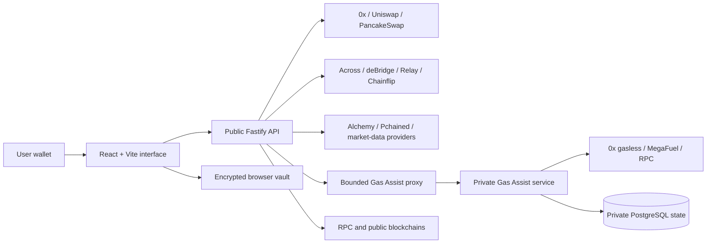

# Hello World

<div align="center">
  
  <h1>PistachioSwap</h1>
  <p><strong>A self-custodial wallet and swap interface built around clearer routing, safer signing, and Gas Assist on BNB Chain.</strong></p>

  <p>
    <a href="https://pistachioswap.com"></a>
    
    
    
    
  </p>
</div>

> [!WARNING]
> PistachioSwap is pre-release software. It has not been independently audited and should not be treated as production-ready financial infrastructure. Use test wallets and small amounts while development continues.

## Why PistachioSwap

A wallet can contain valuable tokens and still be unable to move them because it has no native token for network gas. PistachioSwap is being built around that exact failure mode.

**Gas Assist** can provide an eligible BNB Chain swap route when a connected wallet has a zero native BNB balance. Network costs and PistachioSwap fees are included in the quote and shown before signing. Gas Assist is not described as free, and it remains disabled unless the separately deployed private service is explicitly configured for it.

PistachioSwap also combines route comparison, wallet balances, token discovery, transaction review, and an optional passkey-protected local wallet in one interface.

## Features

| Area | What it does |
| --- | --- |
| **Gas Assist** | Requests eligible zero-native-BNB execution routes through a bounded public proxy and validates the returned fee, route, signer, amounts, and expiry before submission. |
| **Swap routing** | Normalizes quotes from configured providers and selects an executable route using net output rather than decorative marketing numbers. |
| **Pistachio Wallet** | Stores encrypted wallet vaults in browser IndexedDB, requires explicit signing review, and keeps unlocked secret material inside a dedicated worker-owned session. |
| **Wallet portfolio** | Discovers balances and activity through configured indexers, RPC providers, and local Pchained services. |
| **Token discovery** | Uses local ShapeShift asset data plus configured market and security providers to build searchable per-chain catalogs. |
| **Risk presentation** | Separates trusted, unknown, hidden, and potentially unsafe assets instead of presenting every random token as equally respectable. |
| **Backend controls** | The public API applies CORS restrictions, rate limits, provider timeouts, and request validation. Private Gas Assist execution, settlement, replay protection, abuse controls, and administrative operations run in a separate service. |
| **Licensing controls** | Synchronizes third-party notices into production builds and audits dependency licenses separately. |

## Architecture



Provider availability depends on deployment configuration, supported chains, API access, liquidity, and the requested token pair. The private Gas Assist service is maintained and deployed separately from this public repository.

## Security model

PistachioSwap is designed as a self-custodial interface:

- Wallet signatures require explicit user approval.
- The optional Pistachio Wallet stores validated encrypted vault records locally in IndexedDB.
- Unlocked secret material remains worker-owned and is cleared on lock, timeout, account changes, or disposal.
- Browser configuration must never contain private keys, recovery phrases, backend API keys, database credentials, internal service tokens, or treasury secrets.
- The public API exposes only bounded Gas Assist and sponsorship proxy routes. Private administrative routes are not proxied.
- The private Gas Assist service authenticates server-to-server requests and owns quote state, settlement, recovery, replay protection, and abuse controls.
- Public blockchain transactions remain visible, irreversible, and outside PistachioSwap's control once broadcast.

These controls reduce risk; they do not eliminate smart-contract, token, wallet, provider, browser, infrastructure, or blockchain risk.

## Repository layout

```text
.
├── apps/api/                 Public Fastify API and Gas Assist proxy
├── docs/                     Architecture, operational, and legal notes
├── public/                   Static assets and generated legal notices
├── scripts/                  Catalog, licensing, diagnostics, and local tooling
├── src/                      React application and wallet features
└── tests/                    Unit and browser integration tests
```

The private Gas Assist backend is intentionally not stored in this repository. See [`docs/private-gas-assist-boundary.md`](docs/private-gas-assist-boundary.md).

## Local development

### Requirements

- Node.js 24
- `pnpm` 10.30.3 or a compatible repository-supported version
- Provider credentials only for the integrations you enable
- A separately configured private Gas Assist service only when testing Gas Assist

### Install and run

```bash
pnpm install
cp .env.example .env.local
cp apps/api/.env.example apps/api/.env

pnpm --filter @pistachio/api dev
pnpm dev --host 127.0.0.1
```

The frontend defaults to `http://127.0.0.1:5173`, and the public API defaults to `http://127.0.0.1:3001`. The private Gas Assist service normally binds to `127.0.0.1:3002` and must not be exposed directly to the internet.

### Configuration boundaries

- Put public-API secrets in `apps/api/.env`.
- Put only public browser configuration in `.env.local`.
- Never place the Gas Assist internal service token in a `VITE_*` variable.
- Configure only the providers and chains you intend to operate.
- Keep the private Gas Assist service disabled until treasury, fee, provider, database, abuse controls, and operational recovery have been reviewed.
- Use the same random internal token in the public proxy and private service.

See [`apps/api/.env.example`](apps/api/.env.example) and [`docs/private-gas-assist-boundary.md`](docs/private-gas-assist-boundary.md).

## Validation

```bash
pnpm lint
pnpm --filter @pistachio/api typecheck
pnpm test
pnpm build
pnpm licenses:audit
```

`pnpm build` copies the exact installed Reown, WalletConnect, MetaMask, and resolved dependency notices into the production site's `/legal/third-party/` directory. The stricter license audit fails when blocked or unresolved dependency licenses remain.

## Reown AppKit origins

Add each deployed browser origin to the allowlist for the configured Reown project. Typical development and production values are:

```text
http://localhost:5173
http://127.0.0.1:5173
https://pistachioswap.com
https://www.pistachioswap.com
```

AppKit metadata uses `window.location.origin`, so the browser origin must exactly match an allowed Dashboard origin.

## Legal and privacy

These documents are pre-launch drafts. They must be reviewed and finalized for the actual operating entity, deployment, vendors, jurisdictions, fees, and retention practices before commercial launch:

- [Privacy Policy](PRIVACY.md)
- [Terms of Use](TERMS.md)
- [Commercial License](COMMERCIAL-LICENSE.md)
- [Third-Party Notices](THIRD_PARTY_NOTICES.md)
- [Third-Party Licensing Notes](docs/third-party-licensing.md)

Never post private keys, seed phrases, passkey secrets, signed raw transactions, API credentials, internal service tokens, or sensitive vulnerability details in a public issue.

## License

PistachioSwap is **source-available, not open source**.

Owner-controlled code is available under the [PolyForm Noncommercial License 1.0.0](LICENSE). Commercial use requires a separate written license from the project owner. A GitHub fork does not grant commercial hosting rights and does not remove third-party licensing obligations.

Required notices include:

> Portions © 2025 Reown, Inc. All Rights Reserved.

> PistachioSwap uses MetaMask Connect components. Copyright ConsenSys Software Inc. 2022. All rights reserved.

The installed MetaMask terms currently define permitted use to include applications at or below 10,000 monthly active users. Obtain separate permission before exceeding that limit or relying on another use case.

## Contributing

Issues and focused pull requests are welcome for reproducible bugs, accessibility improvements, security hardening, provider correctness, and documentation. Keep changes narrowly scoped, include tests where practical, and preserve the source-available licensing notices.

---

<div align="center">
  <strong>Built to make the missing-gas problem less absurd.</strong>
</div>
